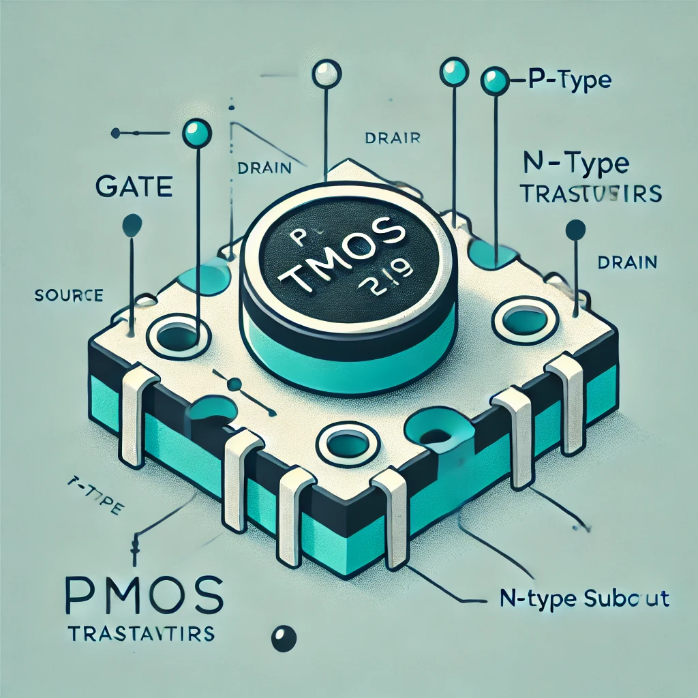
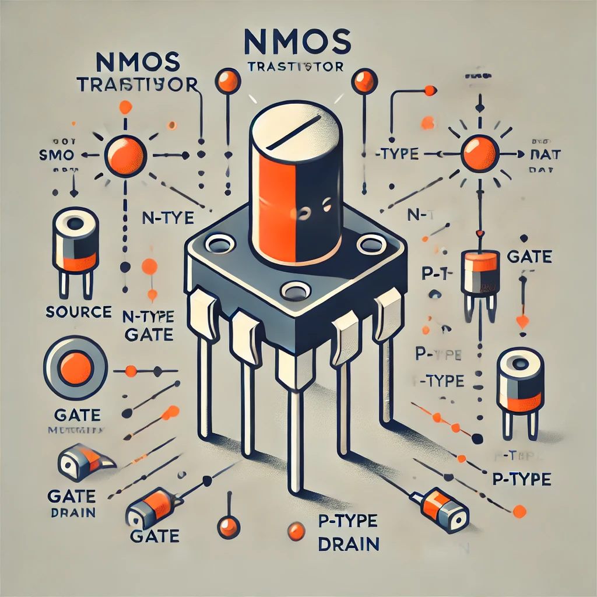
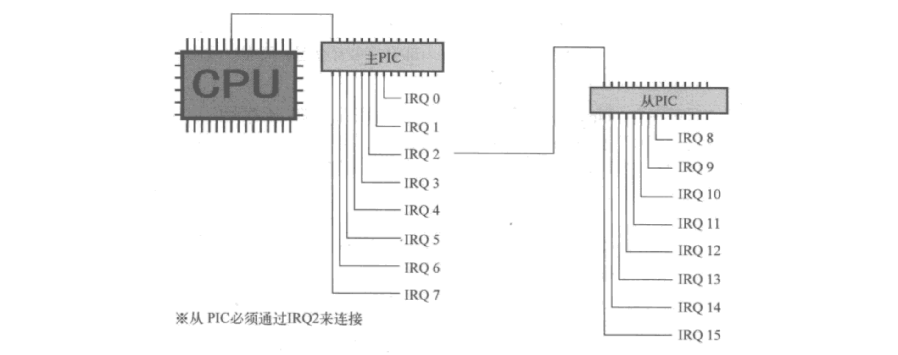

# 《操作系统》开发笔记——基于对408计算机综合的实现

>目前还不准备开发GUI，这是复习笔记，也是开发笔记。光有理论，但没有实践，那得是多神的人，才能耐得住不动手的寂寞。《实践论》中提到：“理性认识依赖于感性认识，感性认识有待于发展到理性认识，这就是辩证唯物论的认识论”。所以，必须要实践，实践才有出路；抛去实践、现实，就只有死路一条。在这个笔记中，将会把《电子技术基础（模拟部分）》、《电子技术基础（数字部分）》和408的《计算机组成原理》、《数据结构与算法》、《操作系统》、《计算机网络》等书揉在一起去理解，在笔记中，还会加入有关的前后端、嵌入式的知识，算是对本科的一次总结吧。对于此玩意，会用到NASM（Intel语法）、GNU GCC（AT&T语法），用NASM是因为它能生成16位实模式下的代码，用GNU GCC是因为它开源啊！所以这东西也会开源。既然是要给x86架构去实现操作系统，那就必须要阅读Intel开发手册了，这样才会知道更多的细节。个人也不是真正的科班出身，只是一个学软件工程出身的，对于这些内容的讲解，肯定会与权威的理论有出入。个人认为对于计算机的一个对底层有着真正理解的人，只需要真正去做一个简单的操作系统即可，操作系统是能够将基础全部包括进去的一个集合，对于操作系统，我们必须能够完成本地计算机的管理以及与其它计算机的访问（这就是计算机网络）。

## 机器结构
>这里的机器结构只以精简指令集的结构去搭建，会在搭建过程中，形成自己的指令集。现代的计算机基本都是数字电路，所以在这里主要记录数字电路计算机的实现。

### 如何去搭建一个简单的CPU
>对于这个模块就得结合数电去讲了，我们得从一个一个MOS管开始去形成一个一个的门电路，然后由门电路搭成各种各样的部件，最后将这些部件组合起来便能形成一个简单的CPU，对于这部分东西，个人理解的不是很深，只是浅尝辄止，但对于去理解计算机到底是如何从高、低电平到一个CPU的过程是完全够用的，有了这些知识，对于计算机的一切，才有了一个很好的基础，也能够在这个基础上更进一步。在搭建的过程中，我们可以完全“手绘”CPU，也可以借助Verilog HDL语言去编写一个CPU。

### MOS管
>对于MOS管来说，分为PMOS管和NMOS管，得结合高中化学来讲述它们的区别。

#### PMOS管
>PMOS是指n型衬底、p沟道，靠空穴的流动运送电流的MOS管。



#### NMOS管
>NMOS英文全称为N-Metal-Oxide-Semiconductor。 意思为N型金属-氧化物-半导体，而拥有这种结构的晶体管我们称之为NMOS晶体管。



### 门电路

#### 与非门

#### 或非门

#### 非门

#### 与门

#### 或门

#### 异或门

#### 同或门

#### 三态门

#### 传输门

### 冯·诺伊曼体系结构
>冯·诺依曼体系结构是现代计算机最主流的结构，它是由五大部分组成的：运算器、控制器、存储器、输入设备、输出设备。其中，运算器与控制器组成了中央处理单元（CPU）。这些各个部件同样也是由以上的各个逻辑门组成的，接下来，将会讲述简单的逻辑门组成相对应的机器部件。


### 各机器部件

#### 基础部件

##### 锁存器

##### 触发器

#### 组合时序部件

##### 编码器

##### 译码器

##### 比较器

##### 加法器

###### 串行加法器

###### 并行加法器

##### 减法器

##### 乘法器

###### 并行乘法器

##### 除法器

##### 运算器

##### 浮点运算器

###### x87FPU
>对于x87FPU，在x86架构中提供了相对应的寄存器组和指令，是CPU中的一部分

##### 通用寄存器组

##### 内存（RAM）

###### 动态内存（DRAM）
>DRAM就是一个一个电容组成的，需要定期去刷新以保证内存中数据的稳定。

###### 静态内存（SRAM）
>SRAM就是一个一个触发器组成的，它不需要去定期刷新，因为在触发器中，时时刻刻都连接着正、负极导线。

##### 外存

##### 排队器

##### 中断响应器

#### 各部件的组合

---

## 计算机组成原理
>这部分是对硬件机器的理论进行补全，同时也是题主自己想要去复习408的一个途径。如果不感兴趣，可以选择跳过。这里的知识点按照唐朔飞老师的《计算机组成原理（第 3 版）》去梳理。

### 计算机系统概论
>计算机系统是由“硬件”和“软件”两大部分组成。
>这里的“硬件”即是由模拟电路和数字电路所构成的硬件，它的构成则是上面机器结构所简单展示的完全体。上面的部分只是让人们有一个基本的认识，是非常不全面的，但能够让人知道一个一个的电子汇聚在一起最后完成各种“计算”的。
>这里的“软件”即是由一条一条的指令构成的程序，对于C语言来说，一条C语言也许就是好多条汇编指令，而汇编指令是对硬件机器直接地抽象，通过电子的流向完成操作，所以计算机根本不懂计算，只是按人设置好的路径走，达到最终的结果罢了。
>>对于C语言形成的程序来说，它得经过以下几个步骤：
>>>预处理->编译->汇编->链接
>>>对应GCC的选项来说，预处理为-E。

#### 计算机语言

##### 第一代：机器语言
>这语言就是由0和1组成的语言，具象化一点就是.bin文件。.bin文件不是可执行文件，可执行文件是与操作系统有关的，它包括操作系统的一些信息，去使程序执行与内存分配不出现问题。

##### 第二代：汇编语言
>

##### 第三代：高级语言
>

##### 第四代：高生产率语言
>

##### 第五代：智能化语言
>

#### 计算机系统简介

---

## 计算机体系结构

### 指令

### 汇编语言
>这里不细讲汇编语言，既然都准备开发操作系统了，那怎么能不提前学相对应机器的汇编语言呢？汇编语言就是对芯片内部结构的直接抽象，个人认为一个比较合理的问题就是：得知了汇编语言的结构后，便可以逆向工程，从而反推出芯片的布线结构。

#### 复杂指令集
>对于复杂指令集，代表有x86汇编语言，详见《汇编语言（第四版）》、《汇编语言：基于x86处理器（第七版）》等书，它们都是Intel语法的教材，在学习Intel语法之外，有需求的话，也可以去学习AT&T语法，这样基本上来说，所有的汇编器都可以使用了。

#### 精简指令集
>对于精简指令集，代表有ARM、RISC-V、MIPS，详见《ARM体系结构与编程（第二版）》等书。最初，龙芯采用的是MIPS架构，后来换为自主设计的loongArch架构，也算是国产之光了。

#### 复杂指令集与精简指令集的区别
>复杂指令集与精简指令集最明显的区别就是：
- 指令集的长度问题（复杂指令集指令不定长，精简指令集定长）
- 是否有内存操作数（复杂指令集有内存操作数，精简指令集没有内存操作数）

#### 对汇编语言的总结
>不同架构的汇编语言是互不兼容的，也就是说在不同架构的机器上去写C语言等高级语言，看似兼容，实则不兼容。对于能在x86架构的机器上运行的C语言产生的最终二进制文件是不能在ARM架构的机器上运行的。因为一条相同的二进制指令，有可能的情况下，x86指令会认为是ADD，而ARM会理解为SUB。（只是为了便于理解，事实上不是这样，但更加复杂）C语言是对汇编语言等进行了封装，需要按照哪一种规则去编译的时候，它就会生成哪一个机器的可执行的二进制代码。在一种架构的机器上去生成另一种架构的最终代码就是交叉编译，这种方式，基本完全贯穿了STM32等简指令集架构嵌入式的开发流程，在x86的机器上去生成ARM的指令（对于GNU GCC是支持这种交叉编译的），更多的汇编语言知识需要自己去学习，开发这个项目是在所难免的，不光将C语言加入到开发中，一切都会变得稍许简单。

---

## 数据结构与算法
>这些东西都能通过任何一种计算机语言去实现，不单单是C语言，像汇编语言、Java、Python等都能够实现这些数据结构。
>个人认为：不论是内存和外存，它们的物理组织形式是不一样的，但它们的逻辑组织方式确实相似的。

### 线性表
>线性表分为顺序表和链表。

#### 顺序表
>对于顺序表而言，它的内存地址空间是连续分配的，那么，我们会有这样一个疑问：为什么总是说它的时间复杂度为O(1)呢？我们必须从它的机器结构讲，学过汇编语言的一定知道：通用寄存器组中有着基地址寄存器和偏移地址寄存器，例如：bx和si。它们相互配合，便能够得到该段或者该页中的数据，如果将基地址放在数据段时，只需改变si便可以完成数据的取用。对于顺序表也是这个道理，只要知道基地址，加上一个偏移，便可以得到想要的数据。在C语言中，我们声明如下数组：
```C
int arr[5];
```
>对于该数组名（标识符），这就是一个基地址，通过[]中的偏移便可以直接定位到想要的数据，正因为这个硬件性质，时间复杂度才能达到O(1)。

##### 与顺序表有关的问题
>对于顺序表，我见过的题型是有和cache结合的问题的，例如：当

#### 链表

### 栈

### 队列

### 串

### 树

### 图

### 堆

### 排序算法

---

## 操作系统

### 内存分配图


### 开发环境的搭建
>开发过程将全部在ubuntu上进行，因为Windows就没有相对应的工具链，非常难受

#### vscode
>这个vscode就是用来做文本打开器的，并不是一个集成环境。所有的代码构建过程都是自己去完成的（除去编译、链接的过程）。只有这一个东西是在Windows上进行运行的。但是要远程连接到ubuntu上，但ubuntu不会自带连接工具，所以在ubuntu中要进行如下的操作：
>>sudo apt-get install openssh-server
>>>在这里，为了进行日后的调试，还得去配置launch.json和tasks.json文件

>在VScode中需要下载扩展：
>>Remote - SSH

>在下载完这些之后，在左侧会出现相对应的图标点进去之后，右键SSH，新建远程，输入以下命令：
>>ssh [username_ubuntu]@[ip] -a
>>而后将其添加至配置文件中，即可完成远程连接。

#### Make
>辅助构建过程，用过的人都说好。在ubuntu中要进行如下的操作：
>>sudo apt install make
>>>对于Make来说，在哪个路径下使用make就意味着Makefile的相对目录的起始位置在哪里，所以在编写Makefile的时候一定要确定当前目录，能写出对的Makefile中的依赖路径。

#### nasm
>在ubuntu中要进行如下的操作：
>>sudo apt install nasm

#### gcc
>在ubuntu中要进行如下的操作：
>>sudo apt install gcc
>>>对于C语言的运行，要进经历数据结构与算法中的一个知识点：预编译、编译、汇编、链接的过程。这样能保证将C语言程序添加到内核中是没有问题的。预处理后的C源文件是不需要进行其它文件的依赖的，因为预编译完的C源文件中已经将其它的依赖全部加进自己的源文件中，直接进行后续的处理即可。
>>>-e选项是为了指定函数的入口地址；-o选项是为了指定输出的东西；-nostdlib选项是为了不链接任何外部库（包括标准库）；-nostartfiles选项是为了可以更方便地结合-e选项去指定入口地址。
>>>-m32 -nostartfiles -fno-builtin -nostdinc -fno-pic -fno-pie -nostdlib -fno-stack-protector -g这些个参数是能够满足开发时，不要链接非自己写的库的要求的。对于标准库也可以用，至于与自制操作系统的接口的设置，这个还得去学习。

#### Bochs
>用来模拟机器，去完成测试。在ubuntu中要进行如下的操作：
>>sudo apt install bochs bochs-x
>>>做完以上的操作，应当生成相对应的bochsrc文件，而这bochsrc文件便可以理解为一台计算机的配置，也就是一个机箱，只不过虚拟出来的。

#### bximage
>在Linux上使用此工具，可以完成磁盘映像文件的制作。
>>bximage -q -hd=16 -mode=create -sectsize=512 -imgmode=flat master.img

#### qemu
>用来模拟机器，去完成调试。配合vscode远程进行调试。这里采用32位的386机器，开发32位的操作系统。
>>qemu-system-i386 -hda -m 32M -boot c xx.img

#### qemu-img
>使用此工具进行映像文件的制作。此工具属于qemu，所以在ubuntu中要进行如下的操作：
>>sudo apt install qemu-utils
>>qemu-img create -f raw disk.img 16M

#### gdb
>用于测试C语言的运行，一条C语言是多条汇编指令的集合，但如果仅靠看执行的效果，而不看细节的话，是很难知道内核是否是真正正确的，所以要依赖gdb去debugC语言的运行。这个得需要去配置vscode中的launch.json和taks.json

#### ubuntu
>这里选择Linux的衍生版本ubuntu作为开发环境，这是因为Linux衍生出的操作系统比Windows的开发套件全，在Windows会遇到各种各样的问题。以下是ubuntu网站和国内镜像网站：
1.ubuntu官网：
https://ubuntu.com/download/desktop
2.网易镜像：
http://mirrors.163.com/ubuntu-releases/
3.中科大
http://mirrors.ustc.edu.cn/ubuntu-releases/
4.阿里云
http://mirrors.aliyun.com/ubuntu-releases/
5.北理工
http://mirror.bit.edu.cn/ubuntu-releases/
6.浙江大学
http://mirrors.zju.edu.cn/ubuntu-releases/
7.清华源
https://mirrors.tuna.tsinghua.edu.cn/ubuntu-releases/


### GRUB

### BIOS
>对于计算机来说，所有机器一上电，都会立马将BIOS读入到内存中，以配合后续的MBR将内核等操作系统重要的部分加载进内存中。对于有操作的人，也可以自己写一个BIOS，或者使用开源的BIOS也行。不过，虚拟机中包含了BIOS不用自己去搭环境；如果你想要在裸机上跑自己写的操作系统，那更不需要了，因为裸机上有BIOS。

**这里是一些比较重要的BIOS中的中断服务例程**：
#### BIOS 中断服务例程
| 中断号 | 功能号（AH） | 功能描述                           | 使用情况/说明                                                                 |
|--------|--------|------------------------------------|------------------------------------------------------------------------------|
| 0x10   | 0x00   | 设置视频模式                       | 选择文字或图形模式。                                                         |
| 0x10   | 0x01   | 设置光标类型                       | 设置光标的开始和结束扫描线。                                                 |
| 0x10   | 0x02   | 设置光标位置                       | 在指定的页上移动光标到某个位置。                                             |
| 0x10   | 0x03   | 获取光标位置和类型                 | 返回当前光标的位置和形状信息。                                               |
| 0x13   | 0x00   | 重置磁盘系统                       | 重置磁盘控制器并检查磁盘状态。                                               |
| 0x13   | 0x02   | 读取扇区                           | 从指定磁盘读取一个或多个扇区到内存中。                                       |
| 0x13   | 0x03   | 写入扇区                           | 将内存中的数据写入指定磁盘的扇区。                                           |
| 0x14   | 0x00   | 初始化串口通信                     | 初始化指定的串行端口。                                                       |
| 0x14   | 0x01   | 发送字符到串口                     | 向串口发送一个字符。                                                         |
| 0x14   | 0x02   | 接收字符                           | 从串口接收一个字符。                                                         |
| 0x15   | 0x88   | 获取扩展内存大小                   | 返回扩展内存的大小（高于1MB的内存）。                                        |
| 0x15   | 0xE820 | 获取系统内存映射                   | 提供详细的内存布局信息（通常用于现代系统引导程序）。                         |
| 0x16   | 0x00   | 读取键盘输入                       | 获取一个按键的扫描码和 ASCII 码。                                            |
| 0x16   | 0x01   | 检查键盘缓冲区                     | 检查键盘缓冲区是否有按键输入。                                               |
| 0x16   | 0x02   | 获取键盘状态标志                   | 返回键盘的状态标志（如 Shift、Ctrl 键是否被按下）。                          |
| 0x17   | 0x00   | 初始化打印机                       | 初始化并检查打印机状态。                                                     |
| 0x17   | 0x01   | 发送字符到打印机                   | 向并行端口的打印机发送一个字符。                                             |
| 0x19   | 无     | 引导加载                           | BIOS 加载启动设备上的引导扇区并启动《操作系统》。                                 |
| 0x1A   | 0x00   | 获取实时时钟时间                   | 返回当前的时分秒以及日期。                                                   |
| 0x1A   | 0x01   | 设置实时时钟时间                   | 设置系统时间为指定的时分秒。                                                 |
| 0x1A   | 0x02   | 获取实时时钟状态                   | 检查实时时钟是否处于有效状态。                                               |
| 0x05   | 无     | 打印字符到 LPT 并等待              | 向并行端口发送一个字符，并等待打印机处理完成。                               |
| 0x12   | 无     | 检测常规内存大小                   | 返回系统中常规内存的大小（单位：KB）。                                        |
| 0x11   | 无     | 获取设备列表                       | 检测系统设备（如软驱、硬盘等）的存在情况。                                   |
| 0x18   | 无     | 空中断服务                         | 通常用作保留或默认中断，未执行实际操作。                                     |
| 0x1C   | 无     | 用户定制定时器中断                 | 用户自定义定时操作，通常与系统时钟配合使用。                                 |
| 0x09   | 无     | 键盘中断                           | BIOS 处理按键事件并更新键盘缓冲区。                                           |

**注意**：
- **功能号** 是调用中断服务时用于指定特定操作的子功能编号。
- 某些中断号（如 0x19、0x05）没有功能号，表示整个中断只提供单一功能。
- 功能的支持可能因 BIOS 的版本和实现而有所不同。
- 对于中断服务例程0x10，使用此函数，可以将ASCLL码的字符输出到屏幕上，为加载内核前的信息的显示提供了可能。
- 对于中断服务例程0x13，使用此函数，可以将采用CHS模式的外存的信息读入内存；但对于LBA的方式，我们只能采用另一种方式。

#### 对BIOS的个人见解
>在开发的过程中，个人认为：单纯的一个BIOS就是一个简单的系统，而BIOS中的中断服务例程就是其中的函数，在学习王爽老师的《汇编语言（第四版）》的时候，明显能感觉出现，我们在DOSBox0.74中使用的所有INT指令都是和开发过程中使用到的BIOS中断服务例程是一样的。

#### 常用的中断服务例程（包括学习汇编语言过程中和开发过程中）

##### 中断服务例程0x10
>对于中断服务例程0x10，是为我们提供了一个在屏幕显示出内容的视频服务。在这里。它的显卡内存是与内存统一编址的，通过对相对应内存的位置进行直接的编写，便可以在相对应的屏幕位置显示出相对应的像素颜色，对多个像素进行操作，便可以绘出自己想要的东西。类比于江协科技的LCD1602和0.96寸的屏幕都是这个道理，对于每个显示器，都有自己的显存，这样在屏幕上维持图像的存在。各个显卡的内存位置是不同的，有些显卡是不统一编址的，得根据实际情况而定。它的输出寄存器为al

##### 中断服务例程0x13
>对于中断服务例程0x13，是为我们提供了一个可以对采用CHS模式的磁盘进行读取和写入的方式，可以去实现在16位实模式下的中级调度和高级调度。但一旦切换到保护模式或者长模式，BIOS的中断服务历程就不可再用，便得借助0x1f1-0x1f7端口去完成对外存的访问。
>在早期的计算机系统中，0x13 中断是用于执行硬盘 I/O 操作的。BIOS 服务。它并不直接使用 0x1F1-0x1F7 端口，但 BIOS 层面的硬盘访问实际上是通过底层的硬盘控制器（如 IDE 或后来的 AHCI 控制器）来完成的。如果硬盘是 IDE 硬盘，0x13 中断调用的 BIOS 服务会间接地利用这些硬盘控制器端口来完成磁盘的读写操作。

##### 中断服务例程0x15

##### 中断服务例程0x21

### 主引导程序
>主引导扇区的作用是将内核等操作系统的各个部分加载进内存，结合上章的中断服务例程可以将配合MOV指令可以将硬件的信息加载进内存，以便之后的各种操作。（对于x86来说是MOV指令，而对于ARM来说则是LDR和STR指令）

#### 主引导扇区在内存中的区域
>对于主引导扇区是有着明确的位置要求的，在x86的要求下，引导扇区会被BIOS加载到内存中的0x7C00的位置，这也是最初设计团队遗留的问题，已经形成了一个固定模式，不管是Windows，还是Linux也得遵守这个规则。

#### 实模式下的内存分配区域
>实模式内存是指在 x86 架构中内存地址空间的前 1MB 区域，其分配如下：

| 内存地址范围    | 大小       | 用途说明                                   |
|-----------------|------------|--------------------------------------------|
| 0000:0000 - 0000:03FF | 1 KB      | 中断向量表（IVT）                          |
| 0000:0400 - 0000:04FF | 256 B     | BIOS 数据区（BDA）                         |
| 0000:0500 - 0000:07FF | 768 B     | 可用内存                                   |
| 0000:0800 - 0000:9FFF | 640 KB    | 常规内存                                   |
| 000A:0000 - 000B:FFFF | 128 KB    | 视频内存                                   |
| 000C:0000 - 000E:FFFF | 192 KB    | BIOS 扩展区，用于设备缓冲区等。             |
| 000F:0000 - 000F:FFFF | 64 KB     | 系统 BIOS                                  |

**注意**：
- 在进入保护模式之前，必须将内核加载器等放在可用位置上；否则，BIOS被破坏，一切都玩完。

#### 实模式下的地址计算
PC = CS * 16 + IP（PC = （CS << 4 ）+ 16）

#### CHS模式和LBA模式
>这部分内容会涉及到软盘或硬盘操作。
##### CHS模式
>这种方式就是《计算机组成原理》中的那种柱面（Cylinder）、扇区（Sector）、磁头（Head）的方式去读取外存，它可以使用0x13去读取，在中断服务例程0x13中，CH对应着柱面、CL对应着扇区、DH对应着磁头，每次调用INT 0x13都得去设置这些相对应的寄存器，下面则是之前对软盘进行读取的代码。

    ; 加载更多的扇区进入内存，根据返回的状态去判断bootLoader是否成功完成加载，返回的状态在通用寄存器中
    
    ; 在这里是为了加载《操作系统》内核进入程序，或者其它的OS运行过程中需要的东西，直到把必要的kernel读进内  存 
    
    ; 相对应的磁盘启动的初始化，这里初始化的逻辑地址是bootSector
    ; 这个外存存储介质只有一个盘片
    ; 这里的算法用C语言来实现就好像是用了三个for循环
    
    ; 最重要的部分对于引导程序
```nasm
    
            ; 用来测试之前的代码是否正确的代码
            ; MOV SI,msg_success
            ; JMP bios_putout
    
            MOV AX,0x0820                           ; 如果忘写这句话，很可能导致BIOS被覆盖
            MOV ES,AX
            MOV CH,CYLINDER_NUM_INIT                ; 对于bootLoader，告诉其先读哪里的柱面、磁头、  扇区
            MOV DH,HEAD_DIRECTION_FRONT
            MOV CL,SECTOR_NUM_INIT
            ADD CL,0X01
    
        try_again:
            MOV SI,0X0000
    
        boot_readloop:
            MOV AH,0x02                             ; 读写磁盘的功能号
            MOV AL,0x01                             ; 这里是一次性读取几个扇区
            MOV DL,DRIVER_A                         ; 这里是驱动盘号
            MOV BX,0X00                             ; 这里的四句都是为了防止因调用中断服务例程而导致    的错误
    ; JMP hello
            INT 0x13
            JNC csh_carry
    
    ; 如果在读的过程中有错误
    
            ADD SI,0X0001
            CMP SI,0X0003
            JAE load_error
            MOV DL,DRIVER_A
            MOV AH,0X00
            INT 0x13
            JMP boot_readloop
    
        csh_carry:                                  ; csh意为cylinder、sector、head
            MOV AX,ES
            ADD AX,0x0020
            MOV ES,AX                               ; 因为在x86的实模式下，对于BIOS的中断服务例程   0x13，物理地址为[ES:BX]，即为ES*16+BX
            ADD CL,0X01
            CMP CL,SECTOR_NUM
            JBE try_again
            MOV CL,SECTOR_NUM_INIT
            ADD DH,0X01
            CMP DH,HEAD_DIRECTION_BACK
            JBE try_again
            MOV DH,HEAD_DIRECTION_FRONT
            ADD CH,0X01
            CMP CH,CYLINDER_NUM
            JBE try_again
```


##### LBA模式
>这种方式更加贴近如今的固态硬盘等，这种的寻址更加广泛，有27位寻址等，对于每一个“地址”，其实都是一个扇区的地址，并不是像内存一样的一个地址就是一个字节。对于有着嵌入式开发经验的人来说，这就和对E^2PROM和FLASH的操作是一致的都是对一块地方进行读写；但对于嵌入式来说，它对外存的操作就相对来说，比较拘束。对于该种模式的操作，详见后面的中高级调度中的对外存的读写。

硬盘控制端口

| Primary 通道            | Secondary 通道 | in 操作      | out 操作     |
| ----------------------- | -------------- | ------------ | ------------ |
| 0x1F0                   | 0x170          | Data         | Data         |
| 0x1F1                   | 0x171          | Error        | Features     |
| 0x1F2                   | 0x172          | Sector count | Sector count |
| 0x1F3                   | 0x173          | LBA low      | LBA low      |
| 0x1F4                   | 0x174          | LBA mid      | LBA mid      |
| 0x1F5                   | 0x175          | LBA high     | LBA high     |
| 0x1F6                   | 0x176          | Device       | Device       |
| 0x1F7                   | 0x177          | Status       | Command      |

- 0x1F0：16bit 端口，用于读写数据
- 0x1F1：检测前一个指令的错误
- 0x1F2：读写扇区的数量
- 0x1F3：起始扇区的 0 ~ 7 位
- 0x1F4：起始扇区的 8 ~ 15 位
- 0x1F5：起始扇区的 16 ~ 23 位
- 0x1F6:
    - 0 ~ 3：起始扇区的 24 ~ 27 位
    - 4: 0 主盘, 1 从片
    - 6: 0 CHS, 1 LBA
    - 5 ~ 7：固定为1
- 0x1F7: out
    - 0xEC: 识别硬盘
    - 0x20: 读硬盘
    - 0x30: 写硬盘
- 0x1F7: in / 8bit
    - 0 ERR
    - 3 DRQ 数据准备完毕
    - 7 BSY 硬盘繁忙


#### 内存检测
##### 内存检测的目的
>为什么要检测内存，这是为了让后续的各种操作更加丝滑，比如说：哪些内存是不可用的，哪些内存是可以被加载的，但另外的一个重要问题是内存管理，这是《操作系统》内核要做的事，并不是内存加载器要干的事，就像408《操作系统》中的内存管理的算法在这里也不用去实现。
##### 内存检测的实现
>对于内存检测的实现，目前个人只知道两种方式：一、通过调用BIOS中的功能号为0xE820的中断服务程序0x15去实现内存的检测；二、通过川合秀实的《30天自制《操作系统》》书中的day_09的方法去实现内存的检测
###### BIOS中断服务程序0x15实现内存检测
>这种方式也是最常用的内存检测的手段，它通过调用BIOS提供的内存检测函数去达到目的。具体方式如下：

| 中断号 | 功能号（AH） | 功能描述                           | 使用情况/说明                                                                 |
|--------|--------|------------------------------------|------------------------------------------------------------------------------|
| 0x15   | 0xE820 | 获取系统内存映射                   | 提供详细的内存布局信息（通常用于现代系统引导程序）。                         |

>对于此中断服务例程，在初始调用时，必须将EAX写入0xE820，EBX写入0x00，ECX写入0x14，EDX写入固定签名0x534D4150（对应的ASCLL为SMAP），从而才可以写INT 0x15去获取内存的情况。但在调用完一次以后，如果还想要调用，便只能重新设置以上的参数（除EBX）。因为调用0x15后，会产生相对应的返回值，CF会被改变（如果CF为0，则表示此次检测没有出错；如果CF为1，则表示此次检测出现问题，应当重启计算机或者检查硬件内存是否出错）、EAX将会被替换为0x534D4150、如果EBX在调用INT 0x15后变为0x00，则说明内存检测已经成功；否则，内存检测没有完成，应当继续。在启用INT 0x15时，应当设置ES:DI的值，这是之后INT 0x15将会把ADRS写入的地址空间。每次调用之后，应当将地址后移20字节，因为目前的ADRS为20字节。以下是检测内存的代码：
```nasm
        detect_RAM:
            XOR EAX,EAX
            XOR EBX,EBX
            XOR ECX,ECX
            MOV EDX,0x534D4150
            MOV ES,AX
            MOV EDI,ADRS_buffer

            next_detect_RAM:
                MOV EAX,0xE820
                MOV ECX,0x14
                INT 0x15
                JC detect_RAM_error
                ADD EDI,ECX
                INC WORD [ADRS_count]
                CMP BX,0x0000
                JNE next_detect_RAM
                  ADRS_count:
        DW 0x0000                   ; 这里的DD就是C语言中的int
        ADRS_buffer:                    ; 将读出的ADRS描述符存放的位置
```

>对于ADRS，它是AddressRange Descriptor Structure地址范围描述符的简称，每一个描述符有20字节，[0,3]字节表示了内存块的起始地址的低四字节，[4,7]字节表示了内存块的起始地址的四字节，[8,11]字节表示了内存块大小的低四字节，[12,15]字节表示内存块大小的高四字节，[16,20]字节表示了这内存块的状态（1为可用，其它均为不可用）

###### 《30天自制《操作系统》》中的方法
>我觉得这方法其实是在[OSDev.org](https://forum.osdev.org/)上的方法，不是其原创，但也算是提供了一种了解“せかい”的方法。

#### 对POST后存储信息的充分利用
>通过一些中断服务程序，获取开机自检后的数据。

#### 实模式到保护模式

##### 全局描述符表（GDT）
>如今的全局描述符有8个字节（共64位），但最后采用LGDT指令只会加载其中的6字节（48位）。全局描述符的格式设计如此繁杂，同一个东西就和商君一样，到处都是。那为什么是这样的？是因为Intel的历史遗留问题，为了能够使新的架构适应之前的架构就需要对CPU内的布线结构做出一定的取舍，所以不得不这样。在学习408操作系统的时候，我们会涉及到分段、分页、段页式的内存管理，GDT主要是对段进行管理，还有专门对页管理的机构。GDT可以完全理解为一个物理或者逻辑上相连的一张表，每一个描述符都是其中的一个表项，它还有一个很像的兄弟IDT，这个东西就可以理解为中断向量表，以供《操作系统》响应外部中断，之后涉及到再细讲。

| 偏移量 (Offset) | 长度 (Length) | 名称 (Name)       | 描述 (Description)                               |
|------------------|---------------|-------------------|-------------------------------------------------|
| 0x00             | 2 字节        | 限长 (Limit Low)  | 段界限的低 16 位，定义段的大小。                 |
| 0x02             | 2 字节        | 基址低 (Base Low) | 段基址的低 16 位，定义段的起始地址。             |
| 0x04             | 1 字节        | 基址中 (Base Mid) | 段基址的中间 8 位。                              |
| 0x05             | 1 字节        | 类型 (Type)       | 描述符类型，包含段类型、DPL、S 位等。            |
| 0x06             | 1 字节        | 限长高 (Limit High) | 段界限的高 4 位，以及标志位（G, D/B, L, AVL）。  |
| 0x07             | 1 字节        | 基址高 (Base High) | 段基址的高 8 位。                                |

针对于0x05、0x06偏移量的字节，还有以下更详细的规定：

| 位   | 7     | 6     | 5     | 4     | 3     | 2     | 1     | 0     |
|------|-------|-------|-------|-------|-------|-------|-------|-------|
| 字段 | **Type** | **S** | **DPL** | **P** |       |       |       |       |

1. **Type (位 7-3)**：
   - 描述符的段类型，控制该段的访问方式，常见类型如下：
     - `0x0`：空描述符（无效）
     - `0x1`：16 位代码段（只读）
     - `0x2`：16 位数据段（读写）
     - `0x3`：16 位代码段（可执行、可读）
     - `0x4`：16 位数据段（只读）
     - `0x5`：任务门（Task Gate）
     - `0x6`：中断门（Interrupt Gate）
     - `0x7`：陷阱门（Trap Gate）
     - `0x8`：32 位代码段（只读）
     - `0x9`：32 位数据段（读写）
     - `0xA`：32 位代码段（可执行、可读）
     - `0xB`：32 位数据段（只读）

2. **S (位 4)**：
   - **S = 0**：表示该段是 **系统段**（如任务门、调用门、中断门等）。
   - **S = 1**：表示该段是 **应用段**（如代码段、数据段）。

3. **DPL (位 3-2)**：
   - 描述符的特权级（Descriptor Privilege Level），决定该段的最低特权级：
     - `00`：内核模式（特权级 0）
     - `01`：系统级（特权级 1）
     - `10`：用户模式（特权级 2）
     - `11`：用户级（特权级 3）

4. **P (位 7)**：
   - **P = 1**：该段 **有效**。
   - **P = 0**：该段 **无效**。

| 位   | 7    | 6    | 5    | 4    | 3    | 2    | 1    | 0    |
|------|------|------|------|------|------|------|------|------|
| 字段 | **Limit High** | **G** | **DB** | **L** | **AVL** |       |       |       |

1. **Limit High (位 15-8)**：
   - 该字段存储 **段界限的高 8 位**。GDT 描述符中 **Limit**（界限）字段总共是 20 位，**Limit High** 字段就是高 8 位。前 16 位存储在 GDT 描述符的 `0x04` 字节中，合起来组成完整的界限值。

2. **G (位 7)**：
   - **G = 1**：段界限的单位是 **4KB**（千字节）。换句话说，段的最大大小是以 4KB 为单位进行计数。
   - **G = 0**：段界限的单位是 **字节**。也就是说，段的大小直接以字节为单位进行计数。

3. **DB (位 6)**：
   - **DB = 1**：该段为 **32 位段**。这通常意味着该段用于 32 位的程序代码或数据。
   - **DB = 0**：该段为 **16 位段**。这是在 16 位操作系统中使用的段，适用于 16 位程序。

4. **L (位 5)**：
   - **L = 1**：该段是 **64 位代码段**。该标志位用于支持 **x86-64** 架构中的 64 位段，通常出现在 64 位操作系统中。
   - **L = 0**：该段不是 64 位段。

5. **AVL (位 4)**：
   - **AVL = 0**：该位通常未使用，并保留为操作系统或硬件的扩展位。一般情况下，操作系统可以忽略此位。
   - **AVL = 1**：该位标记为保留，可能用于未来扩展。

| 字段       | 位置    | 说明                                                         |
|------------|---------|--------------------------------------------------------------|
| Limit High | 15-8    | 段界限的高 8 位                                               |
| G          | 7       | 界限的单位，1 表示 4KB，0 表示字节                            |
| DB         | 6       | 段的大小，1 表示 32 位段，0 表示 16 位段                    |
| L          | 5       | 64 位标志，1 表示 64 位代码段                                |
| AVL        | 4       | 保留位，操作系统可以使用该位扩展功能                       |

>对于C语言中，gdt表项的声明如下：

```c
#define _packed __attribute__((packed))

typedef struct gate_gdt{
    uint_16 low_seg;
    uint_16 low_base;
    uint_8 middle_base;
    uint_8 type : 4;
    uint_8 seg : 1;
    uint_8 DPL : 2;
    uint_8 present : 1;
    uint_8 high_seg : 4;
    uint_8 available : 1;
    uint_8 long_mode : 1;
    uint_8 protected_or_real : 1;
    uint_8 granularity : 1;
    uint_8 high_base;
}_packed gate_gdt;
```


###### 全局描述符的作用

>全局描述符是保护模式下必须添加的东西，没有这个东西，保护模式也就白设计了。既然设计了，我们就要用。用它的好处简单来讲，就是能够更安全的使用内存。通俗来讲，就是通过其，能完成操作系统的用户态（目态）和核心态（管态）之间的切换。在使用、调用、修改这段内存前，会检查其所在GDT的权限，如果权限够，就能对该内存进行修改，如果不够，就不执行。

###### 全局描述符的初始化
>在刚进入保护模式的时候，要初始化GDT，只是简单地设置就可以，不需要完全把内存地各部分全部规定出来，个人认为：最好地方式是在C语言的程序添加对更加详细的GDT。在初始化的时候，GDT的第一个表项一定为 DW 0,0 因为这又是硬件架构的规定，不要问为什么，因为硬件结构决定了一切，如果还想再底层的话，这笔记解决不了问题，得去学CPU设计了。

##### CR0控制寄存器
>在CPU内有两类寄存器，一种是通用寄存器，另一种就是控制寄存器，而CR0就是控制寄存器。通过对控制寄存器的读取、修改、写回，我们可以控制CPU内部的开关进行控制，从而导通电路。参考《电子技术基础（数字部分）》这本书，我们便可以得知，传输门就是一个电子开关。通过将CR0的第0位置为1便可以将CPU的运行模式改为保护模式。但进入32位保护模式之后，CPU是不认识16的BIOS的，所以有意思的就来了，那就是对C语言标准库#include <stdio.h>的部分实现了，例如将一个ASCLL字符输出到屏幕上，如果想要用到键盘、鼠标的话，那就不得不对APIC或PIC去操作了，以响应外部中断。（这里的APIC或PIC就类似于STM32中的EXTI和NVIC，都是对外部中断进行处理的中间桥梁）结合到408专业课来讲就类似于《计算机组成原理》中的排队器和中断向量产生器。

; 代码如下：
```nasm
MOV EAX,CR0
OR EAX,0x00000000
MOV CR0,EAX
```

##### A20地址线
>在实模式下，内存的寻址空间极其有限。但如果转化到保护模式的时候，还不能有更多的空间也是白干，所以Intel设计出了这样的一个开关，当向固定端口写入一定的值，便会将内存寻址的有效值扩大，使更强的软件成为可能。

; 代码如下：
```nasm
IN AL,0x92
OR AL,0x02
OUT 0x92,AL
```

##### 保护模式的限制
>在进入到保护模式后，所有对内存的使用都必须在GDT中进行声明，如果没有在GDT中声明，则会出发一些后果：GP异常、SS异常、PF异常。貌似在Bochs中访问这些没有被注册的段的时候，会导致虚拟机的重启，在开发过程中，出现过这个问题。

---
### 内核
#### 数据类型定义
>为了方便记忆，我们可以使用宏定义去方便操作系统的开发。定义如下：
```c
#define EOF -1

#define NULL 0

#define EOS '\0'

#define bool _Bool
#define true 1
#define false 0

#define _packed __attribute__((packed))

typedef unsigned int size_t;

typedef char int_8;
typedef short int_16;
typedef int int_32;
typedef long long int_64;

typedef unsigned char uint_8;
typedef unsigned short uint_16;
typedef unsigned int uint_32;
typedef unsigned long long uint_64;
```
>这样，可以直观地使用不同位数据类型。

#### 端口
>这里的端口并非是计算机网络中的端口，而是硬件端口（就是相对应的外设地址）。计算机网络中的端口是指应用程序的端口（个人目前认为计算机网络中的端口应该就是我们接下来要自己设置的缓冲区）

##### 对端口的I/O
>也许开发过嵌入式的同学来说，对于通用输入输出口（GPIO）引脚是不陌生的，在这里，也是同样的道理，对于不同的CPU引脚，要给不同的电平，对应到嵌入式中，单片机中有GPIO的寄存器，用以存储电平，这样每个引脚都有相对应的电平。

##### CPU和外设的通信
>在嵌入式开发中，想必都用过I2C、I2S等协议；相对应的，x86也是有CPU与外设之间的协议，但主板上的电气通信协议对我们是透明的，正如我们对端口的操作一样，只需要in和out两条汇编指令便能完成（感觉是不用考虑时序的，不像在嵌入式中，我们还要在开发过程中，考虑协议的时序问题）。通过以下的代码，我们便能够实现对端口的操作;
```nasm
[bits 32]

section .text

global in_byte
global in_word
global out_byte
global out_word

in_byte:
    push ebp
    mov ebp,esp

    xor eax,eax
    mov edx,[ebp + 8]

    ; in 指令的顺序与 out 指令的顺序是不同的，但 in 和 out 指令的地址寄存器只能是ax寄存器
    in al,dx

    jmp $+2
    jmp $+2
    jmp $+2

    leave
    ret

in_word:
    push ebp
    mov ebp,esp

    xor eax,eax
    mov edx,[ebp + 8]

    in ax,dx

    jmp $+2
    jmp $+2
    jmp $+2

    leave
    ret

out_byte:
    push ebp
    mov ebp,esp

    mov edx,[ebp + 8]
    mov eax,[ebp + 12]

    out dx,al

    jmp $+2
    jmp $+2
    jmp $+2

    leave
    ret

out_word:
    push ebp
    mov ebp,esp

    mov edx,[ebp + 8]
    mov eax,[ebp + 12]
    out dx,ax

    jmp $+2
    jmp $+2
    jmp $+2

    leave
    ret
```
```c
#ifndef IO_H_
#define IO_H_

#include <Franklin/datatype.h>

extern uint_8 in_byte(uint_16 port);
extern uint_16 in_word(uint_16 port);

extern void out_byte(uint_16 port, uint_8 value);
extern void out_word(uint_16 port, uint_16 value);

#endif

```

#### 显卡驱动
>显卡中也是有寄存器组的，显卡的存储单元分为功能寄存器组和显存组。就像是在CPU中一样，有的寄存器是不能被指令直接访问的，只能通过读取、修改、写回的方式进行操作，对于基础显卡驱动的部分，会涉及到CRT寄存器的控制，也是这个道理；对于显存来说，能够直接通过对内存的操作方式直接对显存进行操作，是因为该显存进行了统一编址。

##### 基础显卡驱动
>显卡的工作模式分为文本模式和图形模式（文本模式会使用到ASCLL码）
>对于此部分来说，最重要的部分便是CRT控制寄存器，在x86架构中，CRT控制器（CRTC） 的地址寄存器和数据寄存器是通过 索引-数据对 的方式配合使用的。

###### CRT控制器的地址寄存器和数据寄存器
>在操作系统开发中提到的CRT寄存器，通常指的是与显示相关的寄存器，比如CRT控制器中的寄存器。CRT控制器是一种硬件组件，负责处理视频信号，并控制显示器的显示内容。它不是一个单独的芯片，而是集成在某些图形硬件中，尤其是在早期的计算机系统中。在老式的计算机显示系统中，CRT控制器用于生成水平和垂直扫描信号，控制图像的显示。这些控制器的寄存器通常用于设置显示模式、行/列的扫描参数以及图像的缓冲区等。现代的显卡虽然不再使用“CRT控制器”这一术语，但类似的功能已被集成到显卡的硬件和驱动中。如果你指的是更具体的某种硬件结构或是特定架构下的CRT寄存器，可能需要更详细的背景来确定。不过，总的来说，CRT控制器和它的寄存器是集成在图形处理硬件中的，而不是单独的一个芯片。

1. **地址寄存器（Index Register）**：
这个寄存器中的地址指的是将要操作的显卡控制寄存器。
端口地址通常是 0x3D4（彩色模式）或 0x3B4（单色模式）。
用于选择要操作的CRT内部寄存器（如光标位置、显示起始地址等）。

2. **数据寄存器（Data Register）**：
在指定了地址寄存器的情况下，对该写入与读取就是对相应的寄存器进行操作。
端口地址通常是 0x3D5（彩色模式）或 0x3B5（单色模式）。
用于读取或写入由地址寄存器选中的CRT内部寄存器的值。
>这样就可以在头文件中定义：

```c
#define CRT_ADDR_REG 0x3D4 // CRT(6845)彩色索引寄存器
#define CRT_DATA_REG 0x3D5 // CRT(6845)彩色数据寄存器
// 或者
#define CRT_ADDR_REG 0x3B4 // CRT单色索引寄存器
#define CRT_DATA_REG 0x3B5 // CRT单色数据寄存器
```

###### ASCLL码特殊字符
>以下是ASCII码表：
```txt
十进制	十六进制	字符	描述
0	0x00	NUL	空字符 (Null)
1	0x01	SOH	标题开始 (Start of Heading)
2	0x02	STX	文本开始 (Start of Text)
3	0x03	ETX	文本结束 (End of Text)
4	0x04	EOT	传输结束 (End of Transmission)
5	0x05	ENQ	询问 (Enquiry)
6	0x06	ACK	确认 (Acknowledge)
7	0x07	BEL	响铃 (Bell)
8	0x08	BS	退格 (Backspace)
9	0x09	HT	水平制表符 (Horizontal Tab)
10	0x0A	LF	换行 (Line Feed)
11	0x0B	VT	垂直制表符 (Vertical Tab)
12	0x0C	FF	换页 (Form Feed)
13	0x0D	CR	回车 (Carriage Return)
14	0x0E	SO	移出 (Shift Out)
15	0x0F	SI	移入 (Shift In)
16	0x10	DLE	数据链路转义 (Data Link Escape)
17	0x11	DC1	设备控制 1 (Device Control 1)
18	0x12	DC2	设备控制 2 (Device Control 2)
19	0x13	DC3	设备控制 3 (Device Control 3)
20	0x14	DC4	设备控制 4 (Device Control 4)
21	0x15	NAK	否定确认 (Negative Acknowledge)
22	0x16	SYN	同步空闲 (Synchronous Idle)
23	0x17	ETB	传输块结束 (End of Transmission Block)
24	0x18	CAN	取消 (Cancel)
25	0x19	EM	介质结束 (End of Medium)
26	0x1A	SUB	替换 (Substitute)
27	0x1B	ESC	转义 (Escape)
28	0x1C	FS	文件分隔符 (File Separator)
29	0x1D	GS	组分隔符 (Group Separator)
30	0x1E	RS	记录分隔符 (Record Separator)
31	0x1F	US	单元分隔符 (Unit Separator)
32	0x20	(空格)	空格 (Space)
33	0x21	!	感叹号
34	0x22	"	双引号
35	0x23	#	井号
36	0x24	$	美元符号
37	0x25	%	百分号
38	0x26	&	和号
39	0x27	'	单引号
40	0x28	(	左括号
41	0x29	)	右括号
42	0x2A	*	星号
43	0x2B	+	加号
44	0x2C	,	逗号
45	0x2D	-	减号/连字符
46	0x2E	.	句号
47	0x2F	/	斜杠
48	0x30	0	数字 0
49	0x31	1	数字 1
50	0x32	2	数字 2
51	0x33	3	数字 3
52	0x34	4	数字 4
53	0x35	5	数字 5
54	0x36	6	数字 6
55	0x37	7	数字 7
56	0x38	8	数字 8
57	0x39	9	数字 9
58	0x3A	:	冒号
59	0x3B	;	分号
60	0x3C	<	小于号
61	0x3D	=	等号
62	0x3E	>	大于号
63	0x3F	?	问号
64	0x40	@	At 符号
65	0x41	A	大写字母 A
66	0x42	B	大写字母 B
67	0x43	C	大写字母 C
68	0x44	D	大写字母 D
69	0x45	E	大写字母 E
70	0x46	F	大写字母 F
71	0x47	G	大写字母 G
72	0x48	H	大写字母 H
73	0x49	I	大写字母 I
74	0x4A	J	大写字母 J
75	0x4B	K	大写字母 K
76	0x4C	L	大写字母 L
77	0x4D	M	大写字母 M
78	0x4E	N	大写字母 N
79	0x4F	O	大写字母 O
80	0x50	P	大写字母 P
81	0x51	Q	大写字母 Q
82	0x52	R	大写字母 R
83	0x53	S	大写字母 S
84	0x54	T	大写字母 T
85	0x55	U	大写字母 U
86	0x56	V	大写字母 V
87	0x57	W	大写字母 W
88	0x58	X	大写字母 X
89	0x59	Y	大写字母 Y
90	0x5A	Z	大写字母 Z
91	0x5B	[	左方括号
92	0x5C	\	反斜杠
93	0x5D	]	右方括号
94	0x5E	^	插入符号
95	0x5F	_	下划线
96	0x60	`	反引号
97	0x61	a	小写字母 a
98	0x62	b	小写字母 b
99	0x63	c	小写字母 c
100	0x64	d	小写字母 d
101	0x65	e	小写字母 e
102	0x66	f	小写字母 f
103	0x67	g	小写字母 g
104	0x68	h	小写字母 h
105	0x69	i	小写字母 i
106	0x6A	j	小写字母 j
107	0x6B	k	小写字母 k
108	0x6C	l	小写字母 l
109	0x6D	m	小写字母 m
110	0x6E	n	小写字母 n
111	0x6F	o	小写字母 o
112	0x70	p	小写字母 p
113	0x71	q	小写字母 q
114	0x72	r	小写字母 r
115	0x73	s	小写字母 s
116	0x74	t	小写字母 t
117	0x75	u	小写字母 u
118	0x76	v	小写字母 v
119	0x77	w	小写字母 w
120	0x78	x	小写字母 x
121	0x79	y	小写字母 y
122	0x7A	z	小写字母 z
123	0x7B	{	左花括号
124	0x7C	|	竖线
125	0x7D	}	右花括号
126	0x7E	~	波浪号
127	0x7F	DEL	删除 (Delete)
```

>对于这部分，需要系统程序员自己去实现，例如：

```c
#define NUL 0x00
#define ENQ 0x05
#define ESC 0x1B // ESC
#define BEL 0x07 // \a
#define BS 0x08  // \b
#define HT 0x09  // \t
#define LF 0x0A  // \n
#define VT 0x0B  // \v
#define FF 0x0C  // \f
#define CR 0x0D  // \r
#define DEL 0x7F
```

#### 中断描述符表（IDT）
>为了响应外界的中断，我们必须安装IDT表，通过注册IDT表以使计算机响应外部中断，在单片机的开发中，也是这样。

1. **0-15位**：中断处理程序代码段的偏移量（低16位）。
2. **16-31位**：中断处理程序代码段的段选择子（Segment Selector）。
3. **32-39位**：保留字段（通常为0）。
4. **40-43位**：类型字段（Type），用于描述中断门的类型：
  - 0x5：任务门（Task Gate）
  - 0x6：16位中断门（16-bit Interrupt Gate）
  - 0x7：16位陷阱门（16-bit Trap Gate）
  - 0xE：32位中断门（32-bit Interrupt Gate）
  - 0xF：32位陷阱门（32-bit Trap Gate）
5. **44位**：存储段标志（S），通常为0。
6. **45-46位**：描述符特权级（DPL，Descriptor Privilege Level），表示访问该中断门所需的最低特权级（0-3）。
7. **47位**：存在标志（P），表示该描述符是否有效（1表示有效，0表示无效）。
8. **48-63位**：中断处理程序代码段的偏移量（高16位）。

> 对于C语言中，idt表项的声明如下：
```C
#define _packed __attribute__((packed))

typedef struct gate_idt{
    uint_16 low_offset;
    uint_16 segment_selector;
    uint_8 reserved;
    uint_8 TYPE : 4;
    uint_8 S : 1;
    uint_8 DPL : 2;
    uint_8 P : 1;
    uint_16 high_offset;
}_packed gate_idt;
```

##### PIC和APIC

>PIC（可编程中断控制器）和APIC就相当于STM32中EXTI，它可以接收外部中断，将中断信息传递给CPU，由CPU根据相对应的IDT中的中断函数入口地址进行中断的响应。在C语言中，可以如下定义此外设的端口：
```c
#define host_pic_command_port 0x20
#define host_pic_data_port 0x21
#define slave_pic_command_port 0xa0
#define slave_pic_data_port 0xa1
```
>通过以下的代码可以关闭PIC（对端口操作的代码在内核的端口那一节）：
```c
out_byte(host_pic_data_port,0xff);
out_byte(slave_pic_data_port,0xff);
```

##### 键盘中断
>ICW（Initial Control Word）,这个东西对于嵌入式的同志们可能并不陌生，如果陌生，可以类比我们的一些通信协议，如：红外接收头？那么针对这个“协议”，在PC端的的规定如下：

>>ICW1：它只有低五位有效，作用是设置基本工作模式
>>>bit 0 是否需要ICW4（ 1 为要）
bit 1 是否级联（ 0 为未级联）
bit 2 间隔 （通常为 0 ）
bit 3 触发模式 （ 0 为电平触发 1 为边沿触发，对比GPIO的模式）
bit 4 标志位 （必须为 1 ）

>>ICW2：它的高5位为中断向量号的高5位，低3位为对应的IRQ号，作用是设置中断向量号
>>>例子：
>>>>0b_00100_000代表PIC能产生的中断向量是从0x20~0x27，当由该PIC产生中断，CPU中的中断硬件会找到中断向量对应的IDT中的表项，根据表项中保存的中断服务函数的中断函数入口函数进行跳转。

>>ICW3：作用是设置级联连接方式
>>>对于主PIC：每个bit表示对应的IRQ线是否连接了从PIC
对于从PIC：低三位表示连接到主PIC的IRQ线号

>>ICW4：作用是设置PIC的高级功能
>>>bit 0 是否为8086/8088模式（ 1 为是）
bit 1 是否自动结束中断（ 0 为否）
bit 2 是否为缓冲模式（ 0 为无缓冲模式）
bit 3 是否为特殊全嵌套模式（ 0 为否，通常为 0 ）

>在PIC中，键盘的中断被分配到主PIC的1号口上，即为IRQ1上，如下图所示：



>如果要去对PIC使用，就必须对其先进行初始化。
>>PIC的初始化有以下四个步骤：
>>>1.先给command_port进行写入ICW1
2.再给data_port连续发送ICW2、ICW3、ICW4三个字节

>初始化ICW的代码如下：

```c
void init_pic(){
    system_cli();
    out_byte(host_pic_IMR,0xff); // 关闭主PIC上的所有中断响应
    out_byte(slave_pic_IMR,0xff); // 关闭从PIC上的所有中断响应

    out_byte(host_pic_ICW1,0x19);
    out_byte(host_pic_ICW2,0x20); // 0x20~0x27是主PIC的监视范围
    out_byte(host_pic_ICW3,0x02); // 这里代表只有IRQ2上连接着从PIC
    out_byte(host_pic_ICW4,0x01);

    out_byte(slave_pic_ICW1,0x19);
    out_byte(slave_pic_ICW2,0x28);
    out_byte(slave_pic_ICW3,0x02); // 表示从PIC连接到主PIC的IRQ2上
    out_byte(slave_pic_ICW4,0x01);

    out_byte(host_pic_IMR,0xfd); // 表示主PIC只开键盘的中断
    out_byte(slave_pic_IMR,0xff); // 表示从PIC不响应任何外部中断
    system_sti();
}
```

>下面是109键键盘的宏定义以及扫描码与ASCII码映射表

```c
#define ESC 0x01
#define ONE 0X02
#define TWO 0x03
#define THREE 0x04
#define FOUR 0x05
#define FIVE 0x06
#define SIX 0x07
#define SEVEN 0x08
#define EIGHT 0x09
#define NINE 0x0a
#define ZERO 0x0b
#define SUB_SIGN 0x0c
#define EQUAL_SIGN 0x0d
#define BACKSPACE 0x0e
#define TAB 0x0f
#define Q 0x10
#define W 0x11
#define E 0x12
#define R 0x13
#define T 0x14
#define Y 0x15
#define U 0x16
#define I 0x17
#define O 0x18
#define P 0x19
#define LEFT_PARENTHESES 0x1a
#define RIGHT_PARENTHESES 0x1b
#define ENTER 0x1c
#define LEFT_CTRL 0x1d
#define A 0x1e
#define S 0x1f
#define D 0x20
#define F 0x21
#define G 0x22
#define H 0x23
#define J 0x24
#define K 0x25
#define L 0x26
#define SEMICOLON 0x27
#define QUOTES 0x28
#define BACKQUOTE 0x29
#define LEFT_SHIFT 0x2a
#define BACKSLASH 0x2b
#define Z 0x2c
#define X 0x2d
#define C 0x2e
#define V 0x2f
#define B 0x30
#define N 0x31
#define M 0x32
#define COMMA 0x33
#define PERIOD 0x34
#define SLASH 0x35
#define RIGHT_SHIFT 0x36
#define MUL_SIGN 0x37
#define LEFT_ALT 0x38
#define SPACE 0x39
#define CAPS_LOCK 0x3a
#define FUNCTION_ONE 0x3b
#define FUNCTION_TWO 0x3c
#define FUNCTION_THREE 0x3d
#define FUNCTION_FOUR 0x3e
#define FUNCTION_FIVE 0x3f
#define FUNCTION_SIX 0x40
#define FUNCTION_SEVEN 0x41
#define FUNCTION_EIGHT 0x42
#define FUNCTION_NINE 0x43
#define FUNCTION_TEN 0x44
#define NUM_LOCK 0x45
#define SCROLL_LOCK 0x46
#define MINI_KEYBOARD_SEVEN 0x47
#define MINI_KEYBOARD_EIGHT 0x48
#define MINI_KEYBOARD_NINE 0x49
#define MINI_KEYBOARD_SUB_SIGN 0x4a
#define MINI_KEYBOARD_FOUR 0x4b
#define MINI_KEYBOARD_FIVE 0x4c
#define MINI_KEYBOARD_SIX 0x4d
#define MINI_KEYBOARD_ADD_SIGN 0x4e
#define MINI_KEYBOARD_ONE 0x4f
#define MINI_KEYBOARD_TWO 0x50
#define MINI_KEYBOARD_THREE 0x51
#define MINI_KEYBOARD_ZERO 0x52
#define MINI_KEYBOARD_POINT 0x53

#define FUNCTION_ELEVEN 0x57
#define FUNCTION_TWELVE 0x58

#define PRINT_SCREEN 0xe02ae037
#define PAUSE 0xe11d45e19dc5
#define INSERT 0xe052
#define DELETE 0xe053
#define HOME 0xe047
#define END 0xe04f
#define PAGE_UP 0xe049
#define PAGE_DOWN 0xe051
#define UP_ARROW 0xe048
#define DOWN_ARROW 0xe050
#define LEFT_ARROW 0xe04b
#define RIGHT_ARROW 0xe04d

uint_8 keyboard_map[]={
    [0]=0x00,

    [1]=0x1b, // ESC

    [2]=0x31, // 1
    [3]=0x32, // 2
    [4]=0x33, // 3
    [5]=0x34, // 4
    [6]=0x35, // 5
    [7]=0x36, // 6
    [8]=0x37, // 7
    [9]=0x38, // 8
    [10]=0x39, // 9
    [11]=0x30, // 0
    [12]=0x2d, // -
    [13]=0x3d, // =
    [14]=0x08, // backspace
    [15]=0x09, // Tab
    [16]=0x71, // q
    [17]=0x77, // w
    [18]=0x65, // e
    [19]=0x72, // r
    [20]=0x74, // t
    [21]=0x79, // y
    [22]=0x75, // u
    [23]=0x69, // i
    [24]=0x6f, // o
    [25]=0x70, // p
    [26]=0x5b, // [
    [27]=0x5d, // ]
    [28]=0x0d, // enter

    [29]=0x00, // left_ctrl

    [30]=0x61, // a
    [31]=0x73, // s
    [32]=0x64, // d
    [33]=0x66, // f
    [34]=0x67, // g
    [35]=0x68, // h
    [36]=0x6a, // j
    [37]=0x6b, // k
    [38]=0x6c, // l
    [39]=0x3b, // ;
    [40]=0x27, // '
    [41]=0x60, // `

    [42]=0x00, // left_shift

    [43]=0x5c, // '\'
    [44]=0x7a, // z
    [45]=0x78, // x
    [46]=0x63, // c
    [47]=0x76, // v
    [48]=0x62, // b
    [49]=0x6e, // n
    [50]=0x6d, // m
    [51]=0x2c, // ,
    [52]=0x2e, // .
    [53]=0x2f, // /

    [54]=0x00, // right_shift

    [55]=0x2a, // *

    [56]=0x00, // left_alt
    [57]=0x00, // space
    [58]=0x00, // caps lock

    [59]=0x00, // f1
    [60]=0x00, // f2
    [61]=0x00, // f3
    [62]=0x00, // f4
    [63]=0x00, // f5
    [64]=0x00, // f6
    [65]=0x00, // f7
    [66]=0x00, // f8
    [67]=0x00, // f9
    [68]=0x00, // f10

    [69]=0x00, // num lock
    [70]=0x00, // scroll lock
    [71]=0x37, // mini 7 home
    [72]=0x38, // mini 8 up arrow
    [73]=0x39, // mini 9 page up
    [74]=0x2d, // -
    [75]=0x34, // mini 4 left arrow
    [76]=0x35, // mini 5
    [77]=0x36, // mini 6 right arrow
    [78]=0x2b, // +
    [79]=0x31, // mini 1 end
    [80]=0x32, // mini 2 down arrow
    [81]=0x33, // mini 3 page down
    [82]=0x30, // mini 0 ins
    [83]=0x2e, // mini . del

    [84]=0x00,
    [85]=0x00,
    [86]=0x00,

    [87]=0x00, // f11
    [88]=0x00, // f12


    /*
        还有一些特殊按键，等将进程做完之后再补。
        其他键
        键名	按下扫描码	释放扫描码
        Print Screen	0xE0 0x2A 0xE0 0x37	0xE0 0xB7 0xE0 0xAA
        Pause/Break	0xE1 0x1D 0x45 0xE1 0x9D 0xC5	N/A
        Insert	0xE0 0x52	0xE0 0xD2
        Delete	0xE0 0x53	0xE0 0xD3
        Home	0xE0 0x47	0xE0 0xC7
        End	0xE0 0x4F	0xE0 0xCF
        Page Up	0xE0 0x49	0xE0 0xC9
        Page Down	0xE0 0x51	0xE0 0xD1
        ↑ (上箭头)	0xE0 0x48	0xE0 0xC8
        ↓ (下箭头)	0xE0 0x50	0xE0 0xD0
        ← (左箭头)	0xE0 0x4B	0xE0 0xCB
        → (右箭头)	0xE0 0x4D	0xE0 0xCD

    */

};
```

#### 虚拟地址
>硬件二级页表（逻辑三级页表）


>在开启虚拟地址的时候，需要注意：
**1.** 当打开CR0的PG位时，CPU内的CS:EIP的程序计数值还是指向原本物理地址的下一条指令，所以当开启分页管理时，这条物理地址会被解析为虚拟地址，如果没有进行正确的映射，程序执行将会出现错误。为了简单地处理这个情况，直接将实模式下的1M内存在页表中做恒等映射。（这必须确保loader是在这1M范围内的，否则还是会出问题，最主要的是将CS:EIP指向的指令去映射到正确的位置）
**2.** 开启虚拟地址之后，必须将所有要访问的内存映射到正确的位置，例如：VGA显存的内存统一编址。
**3.** 开启分页管理后，需优先初始化IDT。
**4.** 在每次切换进程时，应当将CR3的高20位切换成为当前进程的CR3，以实现在逻辑上各进程独享内存；如果不更换CR3的话，也就是像固定大小段的内存管理了。
**5.** 启用页式管理时，简单的方式就是将整个内存声明为一个段（这就是windows和linux采用的段式内存管理的平坦模式），这样就可以减少因段页式内存管理而产生麻烦。

>对于页目录表、内核页表的声明，应当放在专门的.asm文件中，然后在从这个文件跳转到相对应的内核位置

>在本系统中，采用与linux一致的内核分配的虚拟地址，即都是0xc0000000这一线性地址。（这就要求所有的CR3指向的页目录表都需要在其第768项的位置开始，将操作系统内核映射到这一位置，借由TSS进行用户态区和系统态区的切换，这是发生系统调用时，或者是在发生中断时，中断服务程序也是在内核中，触发中断时，也需要将CPU的状态切换为DPL为00）

##### 进程PCB、CR3、多页目录表、多页表
>进程PCB、CR3、多页目录表、多页表四个东西的关系可以用UML中的类图来说明：(虽然是面向结构的开发，但也能采用面向对象的方法去理解)


##### 物理内存位示图、逻辑内存位示图


#### 调度

>以后直接用这里的高级调度和中级调度去完成虚拟内存等
##### 低级调度
> 低级调度就是我们所知道的进程调度，在初学FreeRTOS的时候，我们经常能够看到如下的代码：

```c
int main(){
    while(1){
        task_one();
        task_two();
    }
}

void task_one(){
    while(1){
        /*code*/
    }
}

void task_two(){
    while(1){
        /*code*/
    }
}
```
>在这里main函数就相当于一个创建函数，而task_one和task_two就是子函数，是在父函数中创建的，并不一定与父函数有很多关系。（个人是知道vTaskCreate()函数的，为了没有学过嵌入式操作系统的同学，便于理解）

##### 中级调度
>这里是中级调度，这里个人没必要保存一些寄存器，因为不是多进程

```nasm
read_disk:
    mov dx,0x1f2
    mov al,bl
    out dx,al

    inc dx
    mov al,cl
    out dx,al

    inc dx
    shr ecx,8
    mov al,cl
    out dx,al

    inc dx
    shr ecx,8
    mov al,cl
    out dx,al

    inc dx
    shr ecx,8
    and cl,0b1111
    mov al,0b1110_0000
    or al,cl
    out dx,al

    inc dx
    mov al,0x20
    out dx,al

    xor ecx,ecx
    mov cl,bl

    .read:
        push cx
        call .waits
        call .reads
        pop cx
        loop .read
    ret

    .waits:
       mov dx,0x1f7
        .check:
            in al,dx
            jmp $+2
            jmp $+2
            jmp $+2
            and al,0b1000_1000
            cmp al,0b0000_1000
            jnz .check
        ret
    
    .reads:
        mov dx,0x1f0
        mov cx,256
        .readw:
            in ax,dx
            jmp $+2
            jmp $+2
            jmp $+2
            mov [edi],ax
            add edi,2
            loop .readw
        ret
```

##### 高级调度
>这里是高级调度，这里个人没必要保存一些寄存器，因为不是多进程
```nasm

```

#### 虚拟内存

#### 设备驱动

##### RTC实时时钟

<h2>参考</h2>

---
1.[https://coreboot.org/](https://coreboot.org/)
2.[https://forum.osdev.org/](https://forum.osdev.org/)
3.[http://hrb.osask.jp/](http://hrb.osask.jp/)
4.[https://chatgpt.com/](https://chatgpt.com/)
5.[https://github.com/StevenBaby/onix](https://github.com/StevenBaby/onix)
6.[https://pages.cs.wisc.edu/~remzi/OSTEP/](https://pages.cs.wisc.edu/~remzi/OSTEP/)
7.[https://chatgpt.com/](https://chatgpt.com/)
8.[https://chat.deepseek.com/](https://chat.deepseek.com/)
9.[bilibili--git](https://www.bilibili.com/video/BV1HM411377j/)
10.[bilibili--onix](https://www.bilibili.com/video/BV1gR4y1u7or/)
11.[bilibili--x86](https://www.bilibili.com/video/BV1eG4y1S7R5/)
12.[bilibili--digital](https://www.bilibili.com/video/BV18p411Z7ce/)
13.[bilibili--STC89C51](https://www.bilibili.com/video/BV1Mb411e7re/)
14.[bilibili--STM32F103C8T6](https://www.bilibili.com/video/BV1th411z7sn/)
15.[steam--turing complete](https://steamcommunity.com/app/1444480/)